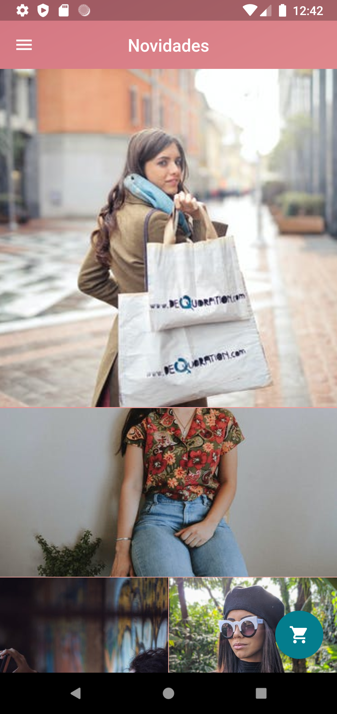
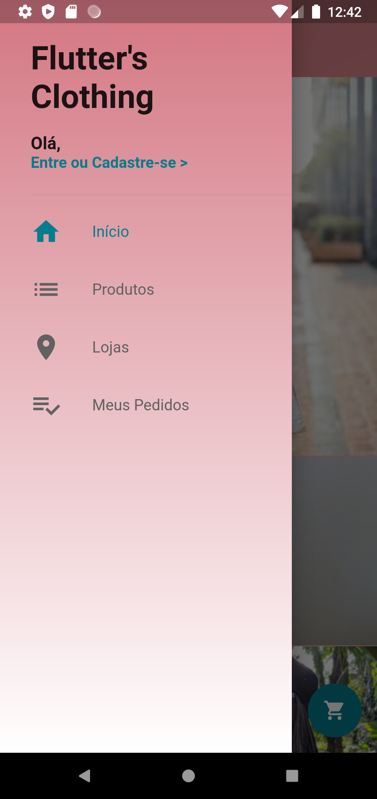
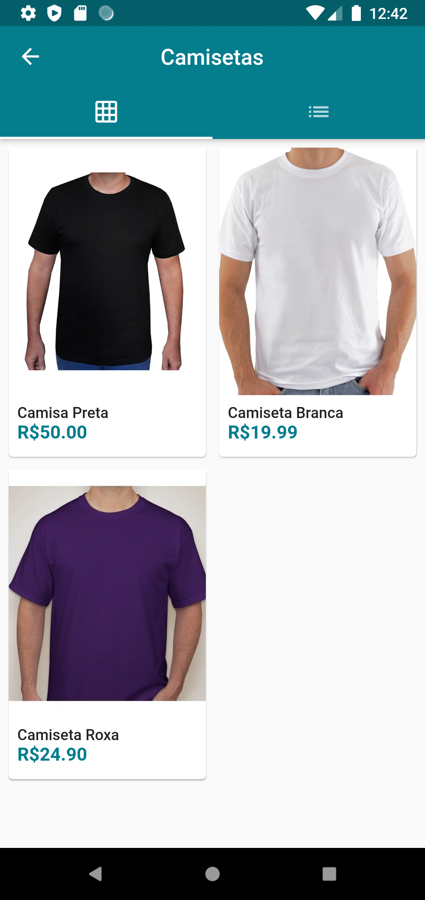
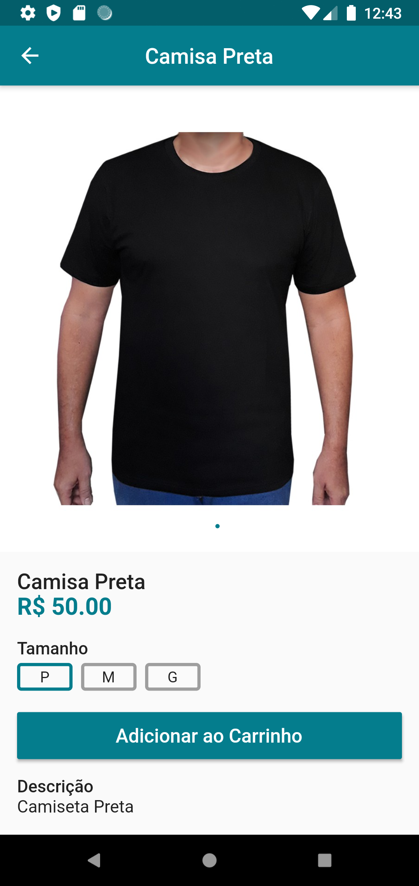
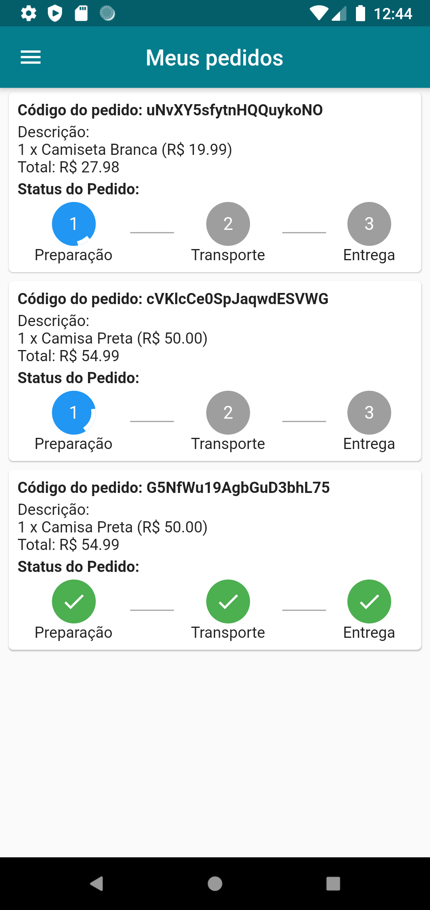

# Contact list

Olá, este é um projeto em flutter de um e-commerce.

Este projeto foi criado simulando uma loja de roupas, utilizando o firebase para o login e para armazenar os produtos.

  

## Screenshots
<table>

<tr>
	<td></td>
	<td></td>
	<td></td>
</tr>

<tr>
	<td></td>
	<td></td>
	<td></td>
</tr>

</table>
